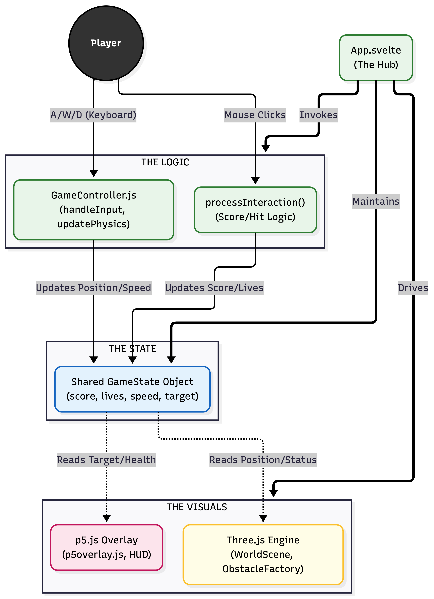

# Overload: A Multitasking Cognitive Training Game 

**Student:** Makhabbat (ID: 20240935)  
**Department:** Industrial Design, KAIST  
**Contact:** [mako1004@kaist.ac.kr](mailto:mako1004@kaist.ac.kr)  
**Links:** [Git Repository](https://github.com/yoondzhy/infinite-runner-multitasking-game) | [Video Demo](https://youtu.be/vDffRuz51hA)

## Project Overview

Overload is an atypical, **cognitively demanding** *infinite runner* inspired by digital therapeutics (DTx) designed for children with ADHD. 

During the Zhejiang University Summer Program, I had the chance to play a clinically tested ADHD-focused game that significantly improved sustained attention. However, the **game isn’t publicly available** and information about it exists only inside [research papers](https://pubmed.ncbi.nlm.nih.gov/41490776/).

This project is my attempt to recreate that idea for myself—as someone who often drifts and wants a way to actively train attention through gameplay. The result is an extreme multitasking runner built with **Three.js**, designed to **overload** and strengthen attentional control, working memory, and task-switching.

## Core Concept

Overload is not a typical runner with 3 lanes—it uses **5 lanes**, faster pacing (over time), and continuous task switching. Players must constantly track rules and obstacle avoidance at the same time, rewarding precision and penalizing mind-wandering. The goal is to maintain total cognitive engagement.

## Gameplay Description

### 1. Five-Lane Movement
* Move between 5 horizontal lanes instead of the standard 3.
* Forces higher spatial attention and faster reaction times.

### 2. Instruction Phase & Target Collecting
At the start of each run:
* The player is shown a **specific type of target item** they must collect.
* Throughout the game, objects fall randomly on the screen.
* Players must collect only the instructed items and avoid irrelevant ones using a hammer (the cursor).
* **Lives:** 5 lives are given for target hitting (top-left corner). Missing or hitting wrong targets reduces these. 
* *Note: These lives are separate from obstacle collisions, which result in an immediate game over.*
* **Booster:** A special booster appears every 10,000 points, doubling the general score and target points for 20 seconds.

### 3. Obstacles
* **Small Computers:** Can be avoided or jumped over.
* **Tall Claw Machines:** Cannot be jumped over; must be dodged.
* Hitting any obstacle leads to an immediate game over.

---

## Library Used

* **Three.js:** Used for all 3D rendering, including the world environment, character models, and skeletal animations.
* **p5.js:** Used for the 2D HUD overlay, fruit/target rendering, and the interactive hammer mechanics.

---

## The Core Organization (MVC Pattern)

<table>
  <tr>
    <td valign="top" width="410">
      
    </td>
    <td valign="top">

**The Model (State)**: Managed in `App.svelte` and `GameManager.js`. This holds the "truth" about the game: player health, current score, active target type, and game speed.

**The View (Rendering)**: Split into two layers:

1. **Three.js Layer** (`WorldScene.js`, `ObstacleFactory.js`): Handles the physical 3D world.

2. **p5.js Layer** (`p5overlay.js`): Handles the 2D cognitive task overlay.

**The Controller (Logic)**: Managed in `GameController.js`. It listens for user inputs (A/W/D, arrows, and spacebar) and updates the Model accordingly.

***

To ensure that only a single instance of the game timer (`uTime`), score, and active speed exists at any given time, I implemented a **Singleton approach**. This was also utilized for the `glbCache` to optimize memory management by preventing redundant asset loading. Additionally, I prioritized the use of **Higher-Order Functions** over traditional loops to ensure more declarative code.

  </tr>
</table>

### Key Functions and Modules

* **GameManager.js / GameController.js (The Brain):**
    * `updatePhysics()`: Calculates gravity, jump velocity, and lane-shifting interpolation.
    * `processInteraction()`: Determines if a mouse click on a fruit was "Correct" or "Incorrect."
    * `updateGameFlow()`: Manages transitions from Landing Page to Instructions and Game Loop.
* **ObstacleFactory.js:** Uses a factory pattern to load obstacles based on spawn probability (tall obstacles are rarer).
* **Reactive UI:** The HUD and Leaderboard "observe" the state. When values change, **Svelte automatically updates** the HTML without the game engine talking to the DOM.
* **Token System:** Used in `swapCharacter()` to prevent "race conditions" between animations (e.g., jumping vs. running).
* **Bridge Pattern:** Since p5.js and Three.js are separate engines, they communicate via a **Shared State Object**.

---

## Challenges

1.  **Working with GLB Files:**
 This was my first time using a 3D .glb model, so figuring out how to load it, play different animations, and switch between them smoothly took a while. I kept running into random issues with the skeleton and animation states, and it was a lot of trial and error until things finally worked the way I wanted.
2.  **Infinite World & Grass Rendering:**
I originally wanted thin, pretty grass that moved nicely with wind. But every version I tried ended up breaking — the grass kept showing weird horizontal lines, especially when I attempted an infinite world where the player stands still and the world generates forward. I even tried using different grass shaders and examples from GitHub, but none of them fixed the glitch.
Eventually I changed the idea: instead of generating an infinite world, I made three ground sections that loop as the player moves. Surprisingly, this not only simplified things but also completely fixed the grass issue.
3.  **The "Gate Test" Idea:**
I also wanted to add a gate section where a question pops up and five gates appear, and the player has to go through the correct one. But adding this meant removing obstacles for a while, updating lives/score logic, and dealing with a bunch of timing issues. After testing, I realized it made the game too complicated and stressful for my friends who tried it, so I decided to keep the game simpler for now.

# Resources Used
As it was hard to start from scratch I used [Commodore 64 by Jason Toff [CC-BY]](https://freefrontend.com/code/procedural-3d-endless-runner-game-2026-02-24/?utm_source=chatgpt.com) to understand how this would be carried out, but eventually ended up changing most of the things. 

I used free 3D models as making some by myseld would take a lot of time:
"Bird in a claw machine" (https://skfb.ly/otMUN) by Tin Pui-yiu is licensed under CC Attribution-NonCommercial-ShareAlike (http://creativecommons.org/licenses/by-nc-sa/4.0/).

Grass taken from https://github.com/DavisHYang/Grass.

Also downloaded the character with animation from [mixamo.com](https://www.mixamo.com/#/?page=2&type=Character) and converted to glb from fbx file.
Overall, I used 4 animations of the main character: dancing(landing page), running, jumping, falling.

The Landing page logo and background were AI generated by Gemini, while the targets were taken from Pinterest where I couldn't find specific owner of paintings.
To carry out this project, I made use of multiple AI agents: mainly google gemini, perplexity for some debugging of stubborn issues and google ai studio for reference. The list of prompts used are presented below. 

Click to view AI prompts used

1. It kinda works but it's just the animation keeps looping in the weirdest unnatural way possible, not like I wanted. Also character is running towards me not the lanes, also when jumping he just disappears.
2. The running model appears perfectly at place, you don't need to change the position! Maybe when he's jumping there are issues but these fixes you are proposing are actually making my runner sink, while jump still doesn't appear. The problem is in jump positions or whatever.
3. Let's just add an animation of the character falling, which is another GLB named "Falling Back Death.glb" and just add that when hit, do the flash effect, give 1-2 seconds before showing the gameover that's it!
4. Copy the grass from here: [https://github.com/DavisHYang/Grass]. Make the grass much much thinner, and only around the lanes not on it, and it also has to move with obstacles to give that illusion that we're running.
5. The grass is not evenly distributed along the entire floor (keep in mind to not go into the lanes). Also there are some lines amidst grass weirdly. Don't add clouds just yet, and you changed the player's position I guess it's off; don't change it nor the scale from the original.
6. The lines are actually gone!! But now the camera moves sides when I change lanes and grass stops generating like it just stops at some point.
7. Can you make the clouds with fuzzy texture instead of those hard 3D edges? And make each clustered with one or two big spheres and a collaboration of smaller ones too.
8. Make the balls smaller, and more balls per cluster, and more lighting on top so there aren't shadows on the clouds. Maybe place clouds a little higher cause it seems too close to the ground.
9. This is how I fixed it: now instead of spheres, let's make the clouds out of clusters of squares.
10. Let's change the entire strategy and make the clouds Minecraft-like, and instead of having horizontal direction make it vertical directed clouds.
11. I don't know how to fix its position because the computer is crooked, 20% in the floor, and I see the back not front.
12. I need A, W, D keyboard to work on the same level as arrows.
13. Now using p5.js we need stuff falling from sky randomly, and a first 3 seconds screen where game shows which ones to collect. The mouse shape should now be a 3D hammer, so I need to find a GLB of a hammer, and around 3 types of things to collect. Only one will be shown and it will need to be collected by pressing, while others also fall but hitting them will result in punishments in attentiveness. If too much wrong ones were hit, attentiveness tanks, making player lose.
14. Let's make the hammer 2D too.
15. Landing page: first of all, the background is gonna be a 3D forest, and on the right there will be our runner, making some pose, and moving all the time (I will need to download some more GLBs). On the left we will do some cool name and big play button, plus a small description of the game.
16. Why can't I see my GLB here?
17. I also don't even see the OVERLOAD logo, and yes, the GLB is nowhere to be seen. For some reason the "NeuroRunner Ready to Focus" window is also here. The background is not grass at all, it's just blue.
18. Add overload_trans.png image to the code, on top of the button, and give it some movement (just some wiggling 2D is enough).
19. Can you bring back the instructions (only what type of targets they have to collect) that appear for a few seconds in the beginning?
20. Now we have to make speed progressive, like it starts slow at first but then it gets faster, but at some point it can't get faster than that cause that would've been chaotic right.
21. My obstacles disappeared after I reached around 4000 in scores.
22. The hearts have to decrease when you hit the wrong target and when you miss the right ones as well, and when hearts die just make them grey and when you're out of hearts you die.
23. It keeps making me die at random spots when the hearts aren't even over. Heart greying out is not working it just disappears. Should we just remove whatever that attentiveness meter was?
24. Why didn't my score update when i got a higher score later?
25. Can you please show the parts that I have to fix?
26. How do I clear the leaderboard now? I have 3 duplicate entries, I can't check if the new logic works or not.
27. Add gates like in the image I attached—they're kinda an opaque surface to go through with answers shown. So about every 5000 score, 5 gates appear on 5 lanes. Before they appear the question will appear in the top center, and before and during the gates' appearance, all obstacles disappear for some time so the player can go through the gate with the right answer without stumbling upon an obstacle.
28. Gates are not moving with the world/ground so I can't go through them at all and I don't even see the mission text on top. The obstacles are still there.
29. We add sun with clouds, adjust the lighting and then after 7k score smooth change to moon and dark sky and adjust lighting accordingly as well.
30. Make the moon and sun not perfectly round but low-poly textured round. Also at night add lighting from the camera's standpoint because it gets too dark.
31. Let's make a visual representation of that next score as yellow and bigger +100.
32. I have an issue... the page before game starts for 3 seconds to show the target? It can't be seen when first entered through the landing page because countdown counts from the time screen loads not from when you pressed play and entered the page. But when you press retry it appears properly.
33. List of improvements we will be implementing: showing on the side which fruit we are collecting so we always know without forgetting; add more types of obstacles so staying on one line throughout the whole game is impossible; maybe changing environments from time to time like adding a city or something; adding golden limited edition fruits falling that will pass quickly but for example boost your scores by 2 for some time. Let's start with adding one more type of obstacle that is bigger than existing computer, any suggestions?
34. New obstacle has to be about 4 times rarer than the main computer obstacle.
35. These proportions worked, but I still can jump through the claw machine, which I don't want to be possible.
36. When I was in star multiplier mode, the score from hitting the right target still was 100.
37. I don't know what I did but now when I hit the right target all floating images freeze and hammer disappears.

<!--  -->

